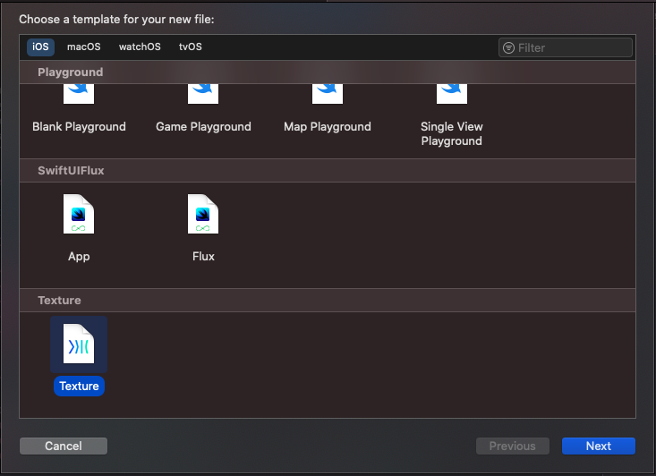

<p align="center">
    
</p>

# Usage 
[Texture](https://github.com/TextureGroup/Texture) Node generator using Xcode template


1. Install using script 
```bash
./install-xcode-template.sh
```

2. select `New file` to use SwiftUIFlux templates in xcode.




 ## Contributing 
 - Issues, Pull Requests always wellcome ❤️

